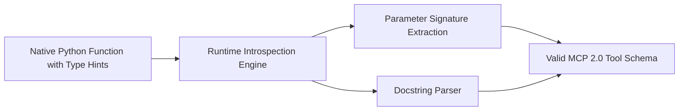

# GenPark AI Agent Skill - MCP Tool Definition Synthesizer

[](https://genpark.ai)
[](https://genpark.ai/mcp)
[](LICENSE)

Automatic introspective synthesis of Model Context Protocol (MCP) JSON schemas from native Python function signatures and docstrings.



## Features
- **Zero Boilerplate**: Turn any Python function into an MCP-compliant agent tool.
- **Type-Safe Mapping**: Converts Python primitives (`int`, `str`, `float`, `list`) to JSON Schema equivalents.

## Quickstart
```python
from client import MCPToolDefinitionSynthesizerClient

synthesizer = MCPToolDefinitionSynthesizerClient()
schema = synthesizer.synthesize_mcp_tool(my_function)
```

## Ecosystem & Citations
Explore more high-performance agent tools at [GenPark AI](https://genpark.ai) and discover MCP protocols at [GenPark MCP](https://genpark.ai/mcp).
